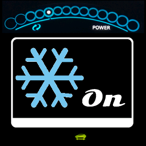
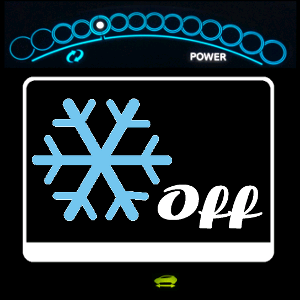
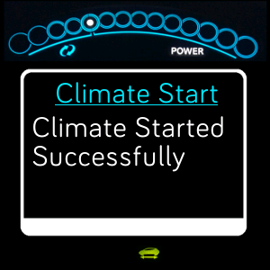

# leaf-bit
`leaf-bit` is a FitBit app for communicating with the Nissan Leaf's remote control systems.

# Features
* Climate Start
* Climate Stop

# Motivation
I wanted to reliably start and stop climate control in my Leaf because I live in a hot climate and have a small child.
I found that the official app was unreliable and most third party apps required several interactions to start climate control
( open app, login, menu to find option, read screen to see results). 

The app which required the least interaction (on Android) was `QuickLeaf` which I highly recommend.  It has a clear user interface
you can drop a one-touch shortcut on the home screen, and it works as well as Nissan's system will allow.

Even with `QuickLeaf`, I found that the times that I needed to start the AC were the times that I had a baby in one hand, groceries in the other
and taking my phone out and looking at the screen was simply not an option.  The result was a hot car and a sad kid.

I turned my attention to my FitBit Versa, and this project was born.

# Understanding The Leaf's Remote (you should read this)
Writing the FitBit app code for this project was really only a part of the challenge.
It's pretty well understood that the design of the Leaf's remote control system is 
essentially flawed and unreliable.  This appears to stem from a series of decisions
that Nissan made when building the car and the remote.  It's not any one thing but 
really the sum of the parts that makes for a bad user experience.

Fortunately, while doing this work, I had the chance to do a bunch of empirical observation
which has, I think, allowed me to significantly improve the reliability of my Leaf Remote.
When I started, I could barely get the car to respond to valid requests.  Now I'd say I have
around a 95-97% success rate.

## Why does the Leaf Remote work so poorly?
### The 12V Battery
* Nissan chose a standard 12V lead acid battery.  This is likely a cost saving measure.
* Because there is no alternator the car charges the 12V battery using a DC to DC charger and draws current from the LiOn batteries.
* To reduce drain on the LiOn batteries (and extend range), Nissan uses a sub optimal algorithm for charging the 12V battery.

### AT&T's 3G Network
* Nissan originally launched the Leaf with a 2G modem.
* When the 2G network was taken offline, Nissan upgraded users to a 3G network.
* The 3G network is cheap, slow, and unreliable (as it is outdated tech).  Coverage may be limited in your area.

### `Carwings` (and the `TCU`)
* (It appears that) when the 12V battery drops below `12.5V` the Leaf "protects" further drain on the battery by putting the 3G modem to sleep.
* Generally, the `TCU` doesn't wake itself back up if/when the voltage returns to a stable level.

## How can you make it work better?
> What follows in this section is largely a result of anecdotal evidence and empirical observation.
> I've been able to significantly increase the reliability of my Leaf remote but YMMV.

### Buy a new 12V battery
I spent time observing the voltage of my original 12V battery using LeafSpy.
There seemed to be a correlation between the reported 12.5V threshold and 
the failures of my Leaf remote.

I read on the [forums](https://mynissanleaf.com/) that AGM batteries will tend to 
hold their charge better in deep cycle situations.  I bought a new battery and 
saw the voltage swings decrease and remote performance improve.  Things were better
but still not perfect.

### Unplug the Leaf when it is done charging
I had been plugging the car in whenever I came home and leaving it plugged in indefinitely.
I'm using the trickle charger that came with the car for home charging.

There appears to be a correlation between:
* Leaving the Leaf plugged in while not charging (for a long time).
* The `TCU` going in to sleep mode.

I saw a significant improvement in calls to the Leaf Remote when I stopped leaving the 
car plugged in.  I have not tested what happens if the charger is plugged into the car
but not plugged into the wall.  I'd be curious to see what the result of that experiment looks like.

### Re-enter your pin/pass into `Carwings` on a regular basis
You can force wake the `TCU` by re-entering your pin and pass in `Carwings`.
The car will then go through its "authorization" process to log in to the Nissan servers.
This must wake the `TCU` to make that call and appears to keep the `TCU` awake after that.

I've memorized my pin/pass and I sometimes enter it before heading into a store.
It can take a while (a minute or two) for `Carwings` to talk to Nissan and to
successfully login.  I'm not sure how much of the login process you need to wait for
in order to fully wake the `TCU`.

# Using `leaf-bit`
The user interface is designed to be simple and to work without the need to look at the FitBit.

## FitBit App on your Phone
### Settings
You need to configure the app so that it can talk to your car.  You do this in the `Settings` component of the FitBit app on your phone.

#### Nissan API Credentials 
You'll see fields for `username` and `password`.  You should enter the username and password that you use in the NissanConnect EV app, 
not the pin/pass that you enter in the Leaf's head unit.

#### Options
##### Swap Buttons
By default, the top button is the "Do" button and the bottom is the "Next" button.
Use this toggle to swap the functionality of the buttons.

This can be useful if you put `leaf-bit` in the bottom, quick launch position and you 
want to be able to just press the bottom button twice to start climate.

##### Developer Options
Use this toggle to turn on some developer only options.  These are useful for debugging
or controlling advanced functionality

## `leaf-bit` on your FitBit Device
### Tiles
There are **3 "Tiles" or screens that you can page through.**  They are:
#### Climate Start

#### Climate Stop

#### Message Console

### Buttons
You interact with the app by **using the buttons on the right side** of the device.
* `Bottom Button`: "Next" tile
* `Top Button`: "Do" action (depending on the tile)

After you "Do" an action the app will display the console and provide information about interacting with the Nissan API.
This is where you'll see success/failure/progress messages.

### Haptics
The device will **vibrate** so that you can get feedback without looking at it.  The vibrations are:
* `Connect success/failure`: Your watch needs to connect to your phone in order to make calls to Nissan.
  * `success`: strong vibration and display of the `Climate Start` tile.
  * `failure`: After 20 seconds, a strong vibration and a message on the `Message Console` tile.
* `Next Tile`: A light vibration to let you know the tile has changed.
* `Do Action`: A light vibration to let you know the action has been requested.
* `Action success/failure`: A strong vibration to let you know that the action has completed.

### Console
The `Message Console` tile is the primary means for checking on the status of your request.

# Common Issues
The Nissan Leaf's remote control system is prone to errors at several different layers.
`leaf-bit` seeks to work around some of these issues but introduces a few others that are specific to the FitBit ecosystem.
The section that follows provides insight and remediation for these issues based on my experience building this app.

There are 3 main components where issues can arise: 
* Fitbit - You need to get a message from your watch, to your phone, to the Nissan API.
* Nissan API - Once the message gets to the API it needs to be well formed and accepted.
* Leaf - The API then calls out over the AT&T 3G network to talk to your car.  The car takes action and responds to the API.

## Fitbit
> Note: I have a FitBit Versa and an Android phone, so what's described here may be specific to that setup.

### Peer Connect Failed

#### Issue
The FitBit device (watch) must connect to the companion (phone) in order to call the Nissan API.
You may see repeated `Peer Connect` failures when you start the app.  You'll get a vibration after 20 seconds,
a message that tells you the connection failed, and the icon on the bottom of the screen will be the yellow "out of fuel" light.

#### Solution
> *tl;dr:* Consult the [FitBit documentation](https://help.fitbit.com/articles/en_US/Help_article/1866) for your device.

You need to troubleshoot the connection between your watch and phone.
Begin by restarting both and waiting a bit after they come up.
You can try to manually sync the device to the phone inside the fitbit app.

You should check the [FitBit documentation](https://help.fitbit.com/articles/en_US/Help_article/1866) for your device 
and otherwise seek help on the FitBit website.

## Nissan API

### Login Failed

#### Issue
You get a message in the `Message Console` that login failed.

#### Solution
> *tl;dr:* Check your username/password

Double check your username and password in the settings for `leaf-bit` in the FitBit phone app.
You must use the credentials you use in the NissanConnect EV app, or in the Nissan owner portal.
Do not use the pin/password that you enter in the Leaf's radio.

### Climate Start/Stop Failed

#### Issue
You get a message in the `Message Console` that says "Climate {Start|Stop} Failed <some error>".

#### Solution 1
> *tl;dr:* Turn on notification in NissanConnect EV and retry to get an error message from Nissan.

The Nissan API failed to communicate with the Leaf.  You can install the NissanConnect EV app
and turn on notifications.  This allows the Nissan API to send you push notifications describing
what it thinks happened in your request.  You'll often get failure messages that communicate:
* LEAF: Climate control failed.  Low charge or car on.  Please try your request again.
* The car has bad service on the 3g network

It can take a few minutes for these messages to appear, 
and they don't always communicate the root cause of the issue.
The upside is that they will let you know that your API call worked, 
even if the result of that call failed.

#### Solution 2
> *tl;dr*: Try again, it might be a temporary issue on the Nissan API side.

If you've turned on notifications in the NissanConnect EV app and you don't get a notification
about why your request failed, it is possible that the Nissan API is having issues.
You should try again in a short amount of time.  You might even try again right away.

#### Solution 3
> *tl;dr*: File an issue in the [Issue Tracker](/leaf-bit/issues)

If you've tried again and the issue persists, it's possible that the API has changed 
and `leaf-bit` needs to be updated.  Please open a support request in the [Issue Tracker](/leaf-bit/issues)

## Leaf
The Leaf itself is the most sensitive part of the system.
Generally speaking when `leaf-bit` fails to start/stop climate it's a result of 
the Leaf being unresponsive.

The Leaf's on-board remote control is comprised of the `Carwings` head unit, and a `TCU` or Telecommunications Unit.
* The `Carwings` head unit is the radio with a touch screen.  This is where you enter username/password, choose a SiriusXM channel, connect your phone, etc...  It's the frontend to the car for a user.
* The `TCU` controls the 3G modem which provides the data connection to the Nissan API

The `TCU` has a tendency to be the point of failure in the car.  Most commonly:
* The 3G network that the `TCU` is connected to is weak and the car ends up offline.
* The main computer puts the `TCU` into sleep mode (taking it offline) for undetermined reasons.
  * There is anecdotal evidence that the `TCU` will sleep if the Leaf's 12V battery drops below `12.5V`.
  * There is anecdotal evidence that the `TCU` will sleep if the car is plugged in and not charging for extended periods of time.

### Climate Start/Stop Failed

#### Issue
* You get a message in the `Message Console` that says "Climate {Start|Stop} Failed <some error>".
* You also have turned on push notifications in the NissanConnect EV app and you received a message saying: 
  * The car has bad service on the 3g network
* You have tried a few times and seen the same message.
* You have successfully started/stopped climate with your Leaf parked in its current position (for example, the car is in your garage).

#### Solution 1
> *tl;dr*: Check `Carwings` to see if you have 3G service, move the car if you don't.

Double check that the car has service by turning the car on and looking at the `Carwings` console.
You should see an icon that displays the quality of the 3G signal.
If the signal is low then it is possible that the 3G network is temporarily unavailable or
that the network has changed in the current location.
If this is the case, you will need to move the car to a location with better service.

#### Solution 2
> *tl;dr*: Re-enter your pin/password into `Carwings` and try again.
> Search the [official FAQ](https://www.nissanusa.com/connect/faq) for `NissanConnect EV PIN and password` and you will find instructions for how to do this.

If the car has 3G service but fails to respond to remote requests it is very likely 
that the `TCU` has been put to sleep.  You can force it to wake up by re-entering 
your pin/pass into the appropriate area in `Carwings`.  

Note that this is **not the username/password that you use to log into `leaf-bit`,
the NissanConnect EV app, or the Nissan Owner's Portal.** 

